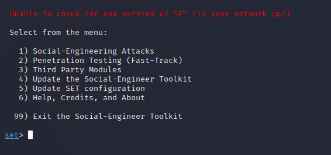
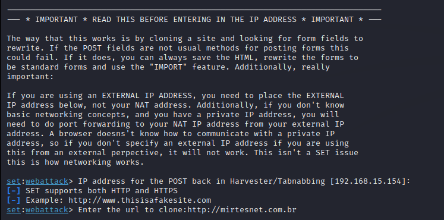

# Phishing para captura de senhas do Mirtesnet

### Ferramentas

- Kali Linux
- setoolkit

- Para esse Exemplo foi usado o site http://www.mirtesnet.com.br

### Configurando o Phishing no Kali Linux

- Acesso root no Kali Linux: ``` sudo su ```
 


- Iniciando o setoolkit: ``` setoolkit ```  


- Tipo de ataque: ``` Social-Engineering Attacks ```


- Vetor de ataque: ``` Web Site Attack Vectors ```


- Método de ataque: ```Credential Harvester Attack Method ```


- Método de ataque: ``` Site Cloner ```



- URL para clone: http://www.mirtesnet.com.br

### Resutados

